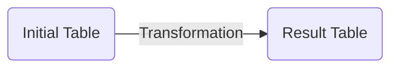

# Learning outcome
- Understand what is SQL and what is it used for
- Input and output of SQL
- Understanding logic behind SQL
- Ability to write SQL command
- Ability to analyze and verify SQL command

# Course content
## I. Tabular data 
### 1.1 Columns - Features/Attributes...
- Each column describe a characteristics of the table
### 1.2 Rows - Observation/Entries/...
- Each row is an observation
### 1.3 Attribute type
- Numerical
- Categorical
- Text
### 1.4 ERD model
- Primary key, secondary key
- Relationship type (1 to many, 1 to one, many to 1,...)

## II. What is SQL and what is it used for
### 2.1 SQL Definition
### 2.2 SQL Command Group


This course focus on Data Query Language Group:
- Mostly used in data analysis
- What is mostly asked in interview

## III. Input and output of Data Query Language Group in SQL

- Input: a table in Database
- Output: a manipulated table for usecase
- Special case of output:
    - A value ~ 1x1 table
    - A series or a row ~ 1d table

### 3.1 Transformation process
- Transformation process can be summarize in 3 steps:
    - Join
    - Manipulation
    - Aggregation
- These steps can be occured one or multiple times in any orders in a SQL command


### 3.2 Manipulation
- Create new table columns by changing or combining values from one/many columns in table
- Special case: 
    - Window function
        - Generate columns by rolling rows values from other columns
        - Including: lag, cummulative sum, rank...
    - Combining window function with general case
### 3.3 Aggregation
- Create a new table which is summarized table of original one.
- Summarized table 

### 3.4 Join


## IV. SQL synstax
### Component of SQL synstax
```sql
Select 
    [Features],
    [Aggregation], 
    [Manipulation]
From table_1 t1
[Left/Right/Inner] join table_2 t2 on t1.key_1 = t2.key_2
Where [condition 1] and/or [condition 2]...
```
- Select: where all manipulation/ aggregation and selection are described
- From: Indicate the **left table** or main table
- Join : 
    - Indicate the right table, type of join and key to join
    - 1 table for each join
    - a join may subject to 1 or many keys.
### Lv 0: Basic query, no transformation required
```sql
Select * 
From table_A
Where [condition 1] and [condition 2]...
```
- Output: table subject to conditions

### Lv 1.1: Join table
```sql
Select * 
From table_A
Where [condition 1] and [condition 2]...
```
- Output: table with rows from joined table
### Lv 1.2: Manipulation & Window Function
```sql
Select 
    a,
    manipulation(b) as b_manipulated,
    manipulation(c,d) as cd_manipulated,
    manipulation(e) over (partition by d order by a) as e_manipulated
From table_A
Where [condition 1] and [condition 2]...
```
- Output: table with additional/modified columns

### Lv 3: Aggregation
```sql
Select 
    a,
    aggregation(b) as b_agg
From table_A
Where [condition 1] and [condition 2]...
```
- Output a summary table for original table_A

### Lv4 : Combination of all

## V. Convert Business question into data-actionable 

- Understand business question
- Break down question into components:
    - Data -> which table
    - Grouping
    - Manipulation
    - Aggregation
